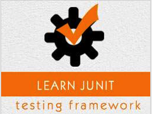

```
Roberto Nogueira  
BSd EE, MSd CE
Solution Integrator Experienced - Certified by Ericsson
```
# TutorialsPoint JUnit



**About**

Learn everything you need to about the subject of this `Tutorialspoint` project.

[Homepage](https://www.tutorialspoint.com/junit/index.htm)

## Topics
```
JUnit Tutorial
[x] Home
[x] Overview
[x] Environment Setup
[ ] Test Framework
[ ] Basic Usage
[ ] API
[ ] Writing a Tests
[ ] Using Assertion
[ ] Execution Procedure
[ ] Executing Tests
[ ] Suite Test
[ ] Ignore Test
[ ] Time Test
[ ] Exceptions Test
[ ] Parameterized Test
[ ] Plug with Ant
[ ] Plug with Eclipse
[ ] Extensions
JUnit Useful Resources
[ ] Questions and Answers
[ ] Quick Guide
[ ] Useful Resources
[ ] Discussion
Selected Reading
[ ] Developer's Best Practices
[ ] Questions and Answers
[ ] Effective Resume Writing
[ ] HR Interview Questions
[ ] Computer Glossary
[ ] Who is Who
```
